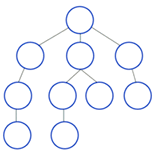
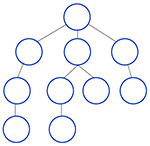
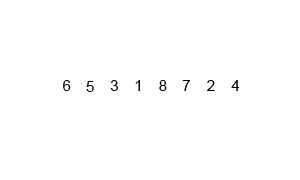

# JS-algorithms
JavaScript Algorithms

| Implementations                |  Preview                                               |
| ------------------------------ | ------------------------------------------------------ |
| [Dijkstra][dijkstra-js]        |                                                        |
| [Interval][interval-js]        |                                                        |
| [Breadth First Search][bfs-js] |    |
| [Depth First Search][dfs-js]   |      |
| [Bubble sort][bubble-sort]     |                            |
| [Merge sort][merge-sort]       |                        |
| [Quick sort][quick-sort]       |                        |

[dijkstra-js]: algorithms/dijkstra.js
[interval-js]: algorithms/interval.js
[bfs-js]: algorithms/bfs.js
[dfs-js]: algorithms/dfs.js
[bubble-sort]: algorithms/bubble-sort.js
[merge-sort]: algorithms/merge-sort.js
[quick-sort]: algorithms/quick-sort.js